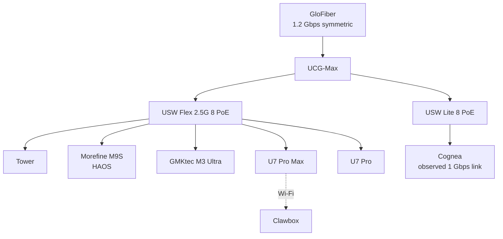

# Network

This page records the physical and logical network observed on 2026-08-30. The
network names describe their configured purpose only. They do not imply any
firewall policy.

## Physical topology

The UCG-Max is in the first-floor living room. The Flex 2.5G switch is in the
living-room closet, and Tower is in the living room. The Lite 8 PoE switch and
Morefine M9S are in the upstairs office. The U7 Pro Max covers the second-floor
office, while the U7 Pro covers the first-floor living room.

## VLANs

| Network | VLAN | IPv4 subnet |
| --- | ---: | --- |
| Management | 1 | `10.1.1.0/24` |
| Trusted | 21 | `10.2.1.0/24` |
| Work | 22 | `10.2.2.0/24` |
| IoT | 31 | `10.3.1.0/24` |
| Camera | 41 | `10.4.1.0/24` |
| Guest | 99 | `192.168.20.0/24` |

## Stable infrastructure addresses

| Device | Address | Role |
| --- | --- | --- |
| UCG-Max | `10.1.1.1`, `10.2.1.1` | Management gateway; Trusted gateway and DNS |
| USW Flex 2.5G 8 PoE | `10.1.1.2` | Primary 2.5GbE access switch |
| USW Lite 8 PoE | `10.1.1.3` | Office PoE access switch |
| U7 Pro Max | `10.1.1.11` | Second-floor wireless access point |
| U7 Pro | `10.1.1.12` | First-floor wireless access point |
| Tower | `10.2.1.21` | Unraid storage and application host |
| GMKtec M3 Ultra | `10.2.1.121` | Linux compute node |
| Morefine M9S | `10.2.1.188` | Home Assistant OS host |

Cognea and Clawbox use DHCP addresses, so their addresses are intentionally
omitted.

## Tailscale

Tailscale connects Cognea, Clawbox, and Tower. Selected applications also have
their own service identities, including Gitea, Hammond, Home Assistant, Immich,
Music Radar, Prowlarr, Radarr, and Sonarr. This view names the participating
systems without publishing overlay addresses, DNS names, or the tailnet domain.
